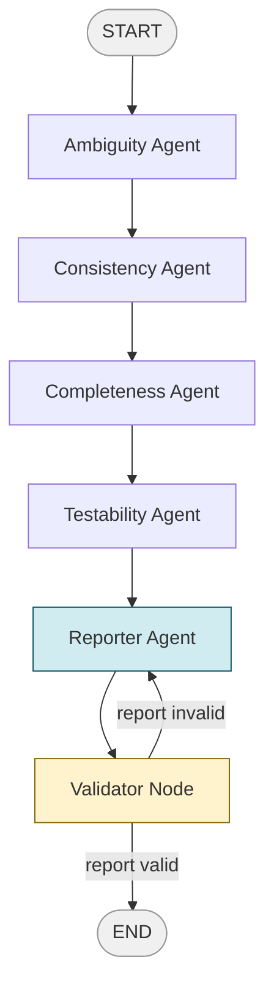

# Requirements Quality Analyzer

A multi-agent system built with LangGraph that automatically analyzes software requirements documents for quality issues. Each agent focuses on a distinct quality dimension, and a reporter agent synthesizes the findings into a structured markdown report.

This project was built to demonstrate hands-on experience with LangGraph, multi-agent orchestration, guardrails design, and LLM-as-judge patterns.

---

## Architecture

The system is a directed graph where each node is a specialized agent. The pipeline runs sequentially, with a conditional edge at the end to validate the final report before exiting.



### Agents

| Agent | Role |
|---|---|
| Ambiguity Agent | Identifies vague or unclear language that could lead to misinterpretation |
| Consistency Agent | Detects contradictions or conflicting requirements |
| Completeness Agent | Flags missing edge cases, undefined terms, or gaps in coverage |
| Testability Agent | Evaluates whether each requirement can be objectively verified |
| Reporter Agent | Synthesizes all findings into a prioritized markdown quality report |
| Validator Node | Checks report validity — routes back to Reporter if malformed |

### Guardrails

The system includes two layers of protection:

- **Input guardrail** — uses an LLM-as-judge pattern to verify the input is a valid requirements document before the pipeline starts. Blocks irrelevant or malicious input.
- **Output guardrail** — validates each agent's JSON response against the expected schema after every LLM call. If invalid, retries once before raising an error.

---

## Tech Stack

- [LangGraph](https://langchain-ai.github.io/langgraph/) — agent orchestration and graph execution
- [LangChain](https://python.langchain.com/) — LLM abstractions and message formatting
- [Streamlit](https://streamlit.io/) — web UI
- [Pydantic](https://docs.pydantic.dev/) — structured state and output validation
- Python 3.11+, uv for dependency management

Supports both **Anthropic Claude** and **OpenAI GPT-4o** as the LLM backend, switchable via `.env` or the UI sidebar.

---

## Project Structure

```
requirements_analyzer/
├── agents/
│   ├── ambiguity_agent.py
│   ├── consistency_agent.py
│   ├── completeness_agent.py
│   ├── testability_agent.py
│   └── reporter_agent.py
├── utils/
│   ├── models.py          # Pydantic state and output models
│   ├── llm_factory.py     # Switchable LLM provider
│   └── guardrails.py      # Input and output validation
├── sample_inputs/
│   └── sample_requirements.md
├── graph.py               # LangGraph pipeline definition
├── app.py                 # Streamlit UI
└── pyproject.toml
```

---

## Getting Started

**1. Clone the repository**

```bash
git clone https://github.com/your-username/requirements-analyzer.git
cd requirements-analyzer
```

**2. Install dependencies**

```bash
uv sync
```

**3. Configure environment**

```bash
cp .env.example .env
```

Edit `.env` and add your API key:

```
ANTHROPIC_API_KEY=your_key_here   # or
OPENAI_API_KEY=your_key_here

LLM_PROVIDER=anthropic            # or openai
```

**4. Run the app**

```bash
uv run streamlit run app.py
```

Then open [http://localhost:8501](http://localhost:8501) in your browser.

---

## Usage

1. Click **Load Sample** to populate the text area with a sample requirements document, or paste your own
2. Select your preferred LLM provider from the sidebar
3. Click **Analyze Requirements**
4. Watch the pipeline progress through each agent in real time
5. Review the generated report and download it as a markdown file

---

## Sample Input

The included sample covers an online banking system with 5 deliberately flawed requirements- each designed to trigger a different quality issue across the four analysis dimensions.

---

## Key Design Decisions

**Why LangGraph?** The sequential pipeline with a conditional retry loop is a natural fit for LangGraph's stateful graph model. Each agent reads from and writes to a shared `GraphState`, keeping agents fully isolated from each other.

**Why structured JSON output?** Forcing each agent to return JSON with a fixed schema makes the output predictable and easy to validate programmatically — essential for a reliable agentic pipeline.

**Why LLM-as-judge for input validation?** Simple keyword rules are too brittle for classifying natural language documents. Using the LLM itself as a classifier handles edge cases more robustly.